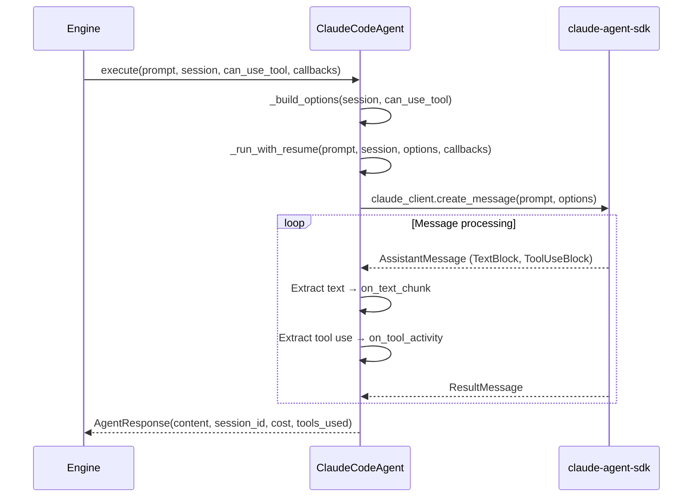
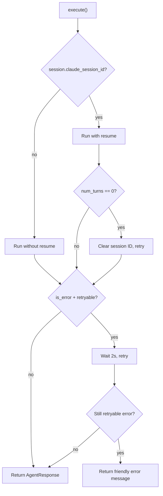

# Agent Protocol

Agents are the bridge between leashd and AI backends. The agent protocol is pluggable — swap the underlying model or SDK without changing the rest of the system.

## `BaseAgent` Protocol

```python
class BaseAgent(Protocol):
    async def execute(
        self,
        prompt: str,
        session: Session,
        *,
        can_use_tool: Callable[..., Any] | None = None,
        on_text_chunk: Callable[[str], Coroutine[Any, Any, None]] | None = None,
        on_tool_activity: Callable[
            [ToolActivity | None], Coroutine[Any, Any, None]
        ] | None = None,
    ) -> AgentResponse: ...

    async def cancel(self, session_id: str) -> None: ...

    async def shutdown(self) -> None: ...
```

| Method | Purpose |
|---|---|
| `execute()` | Run a prompt against the AI, returning a response. Accepts optional callbacks for tool gating, text streaming, and tool activity. |
| `cancel()` | Interrupt an active execution by session ID |
| `shutdown()` | Clean up all resources (connections, sessions) |

## Response Types

### `AgentResponse`

```python
class AgentResponse(BaseModel):
    model_config = ConfigDict(frozen=True)

    content: str
    session_id: str | None = None
    cost: float = 0.0
    duration_ms: int = 0
    num_turns: int = 0
    tools_used: list[str] = Field(default_factory=list)
    is_error: bool = False
```

### `ToolActivity`

```python
class ToolActivity(BaseModel):
    model_config = ConfigDict(frozen=True)

    tool_name: str
    description: str
```

Reported to the engine during execution so streaming can display which tool the agent is currently using.

## `ClaudeCodeAgent`

`ClaudeCodeAgent` (`agents/claude_code.py`) is the built-in implementation wrapping the `claude-agent-sdk`.

### Execute Flow



### Option Building

`_build_options()` constructs `ClaudeAgentOptions` from config and session state:

| Option | Source |
|---|---|
| `cwd` | `session.working_directory` |
| `max_turns` | `config.max_turns` |
| `system_prompt` | `config.system_prompt` + plan mode instruction (if `session.mode == "plan"`) |
| `allowed_tools` | `config.allowed_tools` |
| `disallowed_tools` | `config.disallowed_tools` |
| `resume` | `session.claude_session_id` (for multi-turn continuity) |
| `can_use_tool` | Tool gating callback from engine |

### Plan Mode Instruction

When `session.mode == "plan"`, a `_PLAN_MODE_INSTRUCTION` is appended to the system prompt. This tells the agent to explore and plan before implementing, and to call `ExitPlanMode` when the plan is ready.

### Session Resume with Stale Retry



If a resumed session returns zero turns, it means the session was stale. The agent clears the `claude_session_id` and retries once without resume. This handles cases where the SDK session has expired or been invalidated.

### Transient API Error Retry

When the Anthropic API returns a transient error, the SDK surfaces it as a `ResultMessage` with `is_error=True` and the raw error JSON in `result`. Instead of showing this to users, the agent automatically retries.

**Retryable errors** (matched by content):
- `500` — server error
- `529` — overloaded
- `api_error` — generic API error
- `overloaded` — capacity exceeded
- `rate_limit` — rate limit hit

**Retry behavior:**
- Up to 1 automatic retry with a 2-second backoff between attempts
- The retry loop allows up to 3 total attempts (original + stale session retry + API error retry)
- Non-retryable errors (e.g., `authentication_error`, `invalid_request_error`) are returned immediately

**User-facing message:** When all retries are exhausted and the error is still retryable, `execute()` replaces the raw API error with a friendly message: *"The AI service is temporarily unavailable. Please try again in a moment."* The response still carries `is_error=True` so callers can distinguish it from a success.

## Writing a Custom Agent

Implement the `BaseAgent` protocol:

```python
from leashd.agents.base import AgentResponse, BaseAgent, ToolActivity
from leashd.core.session import Session


class MyAgent:
    async def execute(
        self,
        prompt: str,
        session: Session,
        *,
        can_use_tool=None,
        on_text_chunk=None,
        on_tool_activity=None,
    ) -> AgentResponse:
        # Call your AI backend
        response_text = await my_llm_client.generate(prompt)
        return AgentResponse(content=response_text)

    async def cancel(self, session_id: str) -> None:
        pass

    async def shutdown(self) -> None:
        pass
```

The agent is passed to `build_engine()` — there is no separate registration mechanism.
