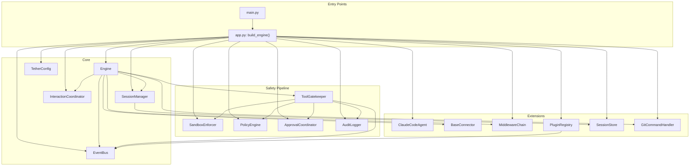
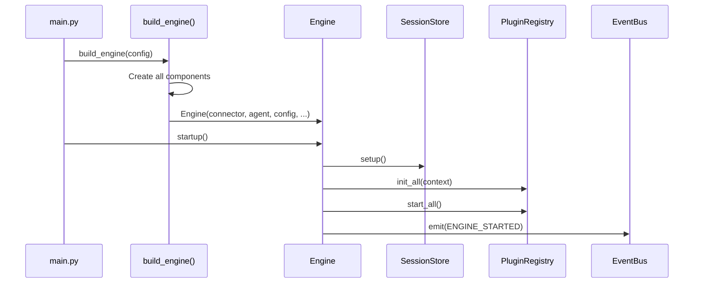
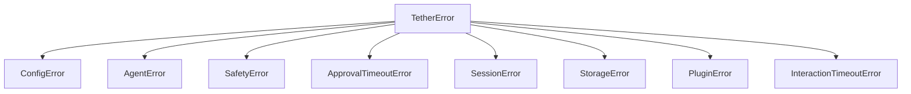

# Architecture

## Design Principles

- **Safety as architecture** — Safety is not a bolt-on. The three-layer pipeline (sandbox, policy, approval) is wired into the core and cannot be bypassed.
- **Composition over inheritance** — Small collaborating objects connected via protocols. No deep class hierarchies.
- **Async-first** — All I/O operations use asyncio. Blocking calls are never made on the event loop.
- **Protocol-based extensibility** — `BaseAgent`, `BaseConnector`, `Middleware`, `TetherPlugin`, and `SessionStore` are all abstract protocols. Swap any implementation without touching the core.
- **Declarative rules** — Safety policies are defined in YAML, not code. Readable, version-controlled, swappable at startup.

## Component Inventory

| Component | Class | Module |
|---|---|---|
| Engine | `Engine` | `core/engine.py` |
| Configuration | `TetherConfig` | `core/config.py` |
| Event bus | `EventBus` | `core/events.py` |
| Session manager | `SessionManager` | `core/session.py` |
| Gatekeeper | `ToolGatekeeper` | `core/safety/gatekeeper.py` |
| Sandbox | `SandboxEnforcer` | `core/safety/sandbox.py` |
| Policy engine | `PolicyEngine` | `core/safety/policy.py` |
| Approval coordinator | `ApprovalCoordinator` | `core/safety/approvals.py` |
| Risk analyzers | `CommandAnalyzer`, `PathAnalyzer` | `core/safety/analyzer.py` |
| Audit logger | `AuditLogger` | `core/safety/audit.py` |
| Interaction coordinator | `InteractionCoordinator` | `core/interactions.py` |
| Agent protocol | `BaseAgent` | `agents/base.py` |
| Claude Code agent | `ClaudeCodeAgent` | `agents/claude_code.py` |
| Connector protocol | `BaseConnector` | `connectors/base.py` |
| Middleware chain | `MiddlewareChain` | `middleware/base.py` |
| Auth middleware | `AuthMiddleware` | `middleware/auth.py` |
| Rate limiter | `RateLimitMiddleware` | `middleware/rate_limit.py` |
| Plugin protocol | `TetherPlugin` | `plugins/base.py` |
| Plugin registry | `PluginRegistry` | `plugins/registry.py` |
| Audit plugin | `AuditPlugin` | `plugins/builtin/audit_plugin.py` |
| Browser tools plugin | `BrowserToolsPlugin` | `plugins/builtin/browser_tools.py` |
| Test runner plugin | `TestRunnerPlugin` | `plugins/builtin/test_runner.py` |
| Merge resolver plugin | `MergeResolverPlugin` | `plugins/builtin/merge_resolver.py` |
| Test config loader plugin | `TestConfigLoaderPlugin` | `plugins/builtin/test_config_loader.py` |
| Git service | `GitService` | `git/service.py` |
| Git command handler | `GitCommandHandler` | `git/handler.py` |
| Git formatter | `GitFormatter` | `git/formatter.py` |
| Git models | `GitStatusResult`, `BranchInfo`, `GitLogEntry`, `GitResult` | `git/models.py` |
| Session store protocol | `SessionStore` | `storage/base.py` |
| Memory store | `MemorySessionStore` | `storage/memory.py` |
| SQLite store | `SqliteSessionStore` | `storage/sqlite.py` |

## Dependency Injection

`build_engine()` in `app.py` is the DI root. It constructs every component, wires dependencies, and returns a fully assembled `Engine`. No component creates its own collaborators.

## Startup Sequence

Shutdown reverses the order: `ENGINE_STOPPED` event, then plugins stop (LIFO), storage tears down, and the agent shuts down.

## Exception Hierarchy

All exceptions inherit from `TetherError` (defined in `exceptions.py`). Each maps to a specific subsystem failure, allowing callers to catch at the right granularity.

## Logging Architecture

Tether uses `structlog` with keyword arguments (no string interpolation).

- **Console handler** — Colored, developer-friendly output. Always active.
- **File handler** — JSON lines with rotating files. Activated when `TETHER_LOG_DIR` is set. Controlled by `TETHER_LOG_MAX_BYTES` (default 10 MB) and `TETHER_LOG_BACKUP_COUNT` (default 5).
- **Audit log** — Separate append-only JSONL file via `AuditLogger`. Path controlled by `TETHER_AUDIT_LOG_PATH`.

Logging is configured by `_configure_logging()` in `app.py`, called at the start of `build_engine()`.
