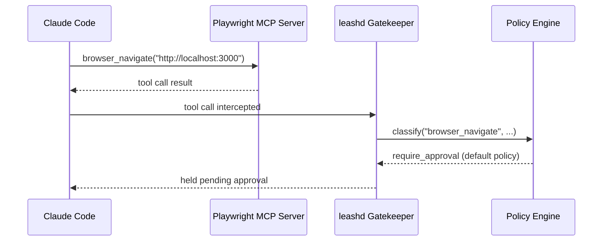

# Browser Testing (Playwright MCP)

leashd integrates with [Playwright MCP](https://github.com/playwright-community/mcp) to give Claude Code browser automation capabilities — navigating pages, clicking elements, taking snapshots, and generating Playwright tests — all gated by leashd's safety pipeline.

## Prerequisites

- **Node.js 18+** — Playwright MCP runs via `npx`, not as a Python package
- **One-time browser install:**

```bash
npx playwright install chromium
```

This downloads the Chromium binary Playwright needs. You only need to do this once per machine.

> **Note:** You'll see a warning about "running without first installing your project's dependencies." This is safe to ignore — the browser binary installs successfully despite the warning. leashd is a Python project and doesn't need `npm install` or a `package.json`.

## How It Works

The integration has three layers:

1. **`.mcp.json`** at the project root tells Claude Code to spawn a Playwright MCP server. Claude Code's SDK handles the MCP server lifecycle — leashd's Python process never touches Playwright directly.

2. **Policy rules** in each YAML preset classify the 28 browser tools. leashd's existing safety pipeline (sandbox → policy → approval) gates every browser tool call.

3. **`BrowserToolsPlugin`** provides structured logging for browser tool events — which tools were invoked, whether they were allowed or denied, and whether they're mutations.



## Setup

The `.mcp.json` is already committed to the repo:

```json
{
  "mcpServers": {
    "playwright": {
      "command": "npx",
      "args": ["@playwright/mcp@0.0.41"]
    }
  }
}
```

After installing browser binaries, verify the MCP server is available by running `/mcp` in a Claude Code session. You should see `playwright` listed as a connected server with 28 tools.

## Configuration Options

The `.mcp.json` args array accepts Playwright MCP flags:

| Flag | Default | Description |
|---|---|---|
| `--headless` | — | Run browser without a visible window (for CI) |
| `--browser` | `chromium` | Browser to use: `chromium`, `firefox`, or `webkit` |
| `--cdp-endpoint` | — | Connect to an existing Chrome DevTools Protocol endpoint |
| `--config` | — | Path to a Playwright config file |

Headed mode (visible browser window) is the default. To switch to headless for CI, edit `.mcp.json`:

```json
{
  "mcpServers": {
    "playwright": {
      "command": "npx",
      "args": ["@playwright/mcp@0.0.41", "--headless"]
    }
  }
}
```

## Browser Tools

Playwright MCP exposes 28 tools, split into two categories:

### Readonly (7 tools)

These observe the page without changing it:

| Tool | Description |
|---|---|
| `browser_snapshot` | Accessibility tree snapshot of the current page |
| `browser_take_screenshot` | PNG screenshot of the viewport |
| `browser_console_messages` | Retrieve console log messages |
| `browser_network_requests` | List network requests made by the page |
| `browser_tab_list` | List open browser tabs |
| `browser_wait_for` | Wait for a condition (selector, text, timeout) |
| `browser_generate_playwright_test` | Generate a Playwright test from recorded actions |

### Mutation (21 tools)

These interact with or change the page:

| Tool | Description |
|---|---|
| `browser_navigate` | Navigate to a URL |
| `browser_navigate_back` | Go back in history |
| `browser_navigate_forward` | Go forward in history |
| `browser_click` | Click an element |
| `browser_type` | Type text into an element |
| `browser_hover` | Hover over an element |
| `browser_drag` | Drag and drop |
| `browser_press_key` | Press a keyboard key |
| `browser_select_option` | Select a dropdown option |
| `browser_file_upload` | Upload a file |
| `browser_handle_dialog` | Accept/dismiss dialogs |
| `browser_fill_form` | Fill multiple form fields at once |
| `browser_evaluate` | Execute JavaScript on the page or element |
| `browser_tabs` | List, create, close, or select browser tabs |
| `browser_tab_new` | Open a new tab |
| `browser_tab_select` | Switch to a tab |
| `browser_tab_close` | Close a tab |
| `browser_resize` | Resize the viewport |
| `browser_pdf_save` | Save page as PDF |
| `browser_close` | Close the browser |
| `browser_install` | Install a browser |

## Policy Rules

Each built-in policy preset handles browser tools differently:

| Policy | Readonly tools | Mutation tools |
|---|---|---|
| **default** | Allow | Require approval |
| **strict** | Require approval | Require approval |
| **permissive** | Allow | Allow |

The rules are defined in the respective YAML files under `policies/`. The readonly/mutation split lets the default policy auto-allow observation (snapshots, screenshots, console logs) while gating interactions (clicks, typing, navigation) behind your approval.

See [Policies](policies.md) for the full rule matching algorithm and comparison table.

## BrowserToolsPlugin

The `BrowserToolsPlugin` (`plugins/builtin/browser_tools.py`) provides structured logging for all 28 browser tools. It subscribes to three events:

| Event | Logged when |
|---|---|
| `TOOL_GATED` | A browser tool call enters the safety pipeline |
| `TOOL_ALLOWED` | A browser tool call is approved (by policy or human) |
| `TOOL_DENIED` | A browser tool call is denied |

Each log entry includes the tool name, session ID, and an `is_mutation` flag indicating whether the tool modifies the page.

The plugin also exports constants for use in custom code:

- `BROWSER_READONLY_TOOLS` — frozenset of 7 readonly tool names
- `BROWSER_MUTATION_TOOLS` — frozenset of 21 mutation tool names
- `ALL_BROWSER_TOOLS` — union of both sets
- `is_browser_tool(tool_name)` — returns `True` if the tool is a Playwright browser tool

See [Plugins](plugins.md) for the plugin protocol and lifecycle.

## Playwright Test Agents

Playwright provides three AI test agents that work with Claude Code:

| Agent | Purpose |
|---|---|
| **Planner** | Analyzes the app and creates a test plan |
| **Generator** | Generates Playwright test code from the plan |
| **Healer** | Finds and fixes broken tests by inspecting the live UI |

### Setup

Initialize the Playwright test agents in your project:

```bash
npx playwright init-agents --loop=claude
```

### The `/healer` Command

leashd includes a `/healer` slash command (`.claude/commands/healer.md`) that invokes the healer agent workflow:

1. Run the failing test suite with `npx playwright test`
2. Analyze Playwright trace files for each failure
3. Use `browser_snapshot` to inspect the current UI state
4. Compare expected vs actual state
5. Fix test code (selectors, assertions, waits)
6. Re-run to confirm the fix

## Local Workflow

A typical browser testing session looks like this:

1. **Start your dev server** — e.g., `npm run dev` in a separate terminal
2. **Launch Claude Code** in the leashd project directory
3. **Ask Claude to navigate** — "Go to http://localhost:3000 and check if the login form renders"
4. Claude calls `browser_navigate` → gated by policy → you approve (in default policy)
5. Claude calls `browser_snapshot` → auto-allowed (readonly) → returns the page structure
6. Claude reports what it found and can generate tests, fix issues, etc.

## Token Cost Considerations

Browser tools vary significantly in token usage:

- **`browser_snapshot`** returns an accessibility tree (text-based, compact). Prefer this for understanding page structure.
- **`browser_take_screenshot`** returns a PNG image encoded in the response. This is much more expensive in tokens and context window usage.

Use `browser_snapshot` for routine inspection and reserve `browser_take_screenshot` for visual debugging where layout matters.

## Known Gotchas

- **Misleading npm warning** — `npx playwright install chromium` prints a warning about missing project dependencies. This is safe to ignore — the browser installs successfully. leashd is a Python project and doesn't need `npm install` or a `package.json`.
- **Version pinning** — `.mcp.json` pins `@playwright/mcp@0.0.41`. Updating may change tool names or behavior. Test after upgrading.
- **Windows Chrome conflict** — On Windows, if Chrome is already open, Playwright may fail to launch. Close existing Chrome instances or use `--cdp-endpoint` to connect to a running instance.
- **Context window exhaustion** — Heavy use of `browser_take_screenshot` can fill the context window quickly. Use `browser_snapshot` (text-based) when possible.
- **Dev server must be running** — Playwright navigates a real browser. Your app needs to be served locally (or remotely) for `browser_navigate` to work.
- **Headless limitations** — Headed mode is the default. If you've added `--headless` to `.mcp.json` for CI, note that some UI interactions (file picker dialogs, OS-level notifications) don't work in headless mode. Remove `--headless` to restore headed mode.
