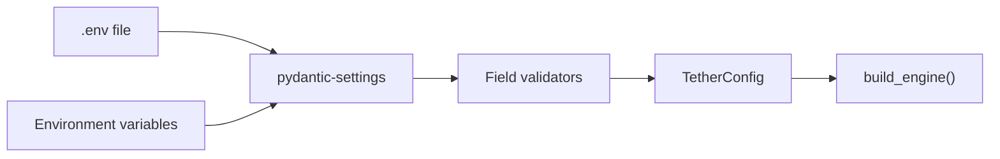

# Configuration Reference

`TetherConfig` (`core/config.py`) uses pydantic-settings to load configuration from environment variables prefixed with `TETHER_`. Values can also be set in a `.env` file in the project root.

## Loading Flow



Environment variables override `.env` file values. Validators run after loading to resolve paths, parse user IDs, and validate policy files.

## Required Variables

| Variable | Type | Description |
|---|---|---|
| `TETHER_APPROVED_DIRECTORIES` | `list[Path]` | Directories the agent is allowed to operate in (comma-separated). All must exist. Expanded and resolved to absolute paths. First directory is the default working directory. |

## Full Reference

### Agent Settings

| Variable | Type | Default | Description |
|---|---|---|---|
| `TETHER_MAX_TURNS` | `int` | `25` | Maximum agent turns per message |
| `TETHER_AGENT_TIMEOUT_SECONDS` | `int` | `1800` | Agent execution timeout in seconds (30 minutes) |
| `TETHER_SYSTEM_PROMPT` | `str \| None` | `None` | Additional system prompt appended to the agent |
| `TETHER_ALLOWED_TOOLS` | `list[str]` | `[]` | Whitelist of tools the agent can use (empty = all) |
| `TETHER_DISALLOWED_TOOLS` | `list[str]` | `[]` | Blacklist of tools the agent cannot use |
| `TETHER_MCP_SERVERS` | `dict` | `{}` | JSON dict of MCP server configurations |

### Safety Settings

| Variable | Type | Default | Description |
|---|---|---|---|
| `TETHER_POLICY_FILES` | `list[Path]` | `[]` | Comma-separated paths to YAML policy files. Loaded in order; later files can override settings. |
| `TETHER_APPROVAL_TIMEOUT_SECONDS` | `int` | `300` | Seconds to wait for human approval before defaulting to deny |
| `TETHER_INTERACTION_TIMEOUT_SECONDS` | `int \| None` | `None` | Seconds to wait for user response to questions and plan reviews. `None` = wait indefinitely. |

### Authentication & Rate Limiting

| Variable | Type | Default | Description |
|---|---|---|---|
| `TETHER_ALLOWED_USER_IDS` | `set[str]` | `set()` | Comma-separated user IDs allowed to interact. Empty set = allow all. |
| `TETHER_RATE_LIMIT_RPM` | `int` | `0` | Requests per minute per user. `0` = no rate limiting. |
| `TETHER_RATE_LIMIT_BURST` | `int` | `5` | Maximum burst size for rate limiter token bucket |

### Connector

| Variable | Type | Default | Description |
|---|---|---|---|
| `TETHER_TELEGRAM_BOT_TOKEN` | `str \| None` | `None` | Telegram bot API token. If set, runs with Telegram connector. If unset, runs CLI REPL. |

### Storage

| Variable | Type | Default | Description |
|---|---|---|---|
| `TETHER_STORAGE_BACKEND` | `str` | `"sqlite"` | Storage backend: `"sqlite"` (persistent, default) or `"memory"` |
| `TETHER_STORAGE_PATH` | `Path` | `.tether/messages.db` | Path to SQLite database file (only used when backend is `"sqlite"`) |

### Agent Mode

| Variable | Type | Default | Description |
|---|---|---|---|
| `TETHER_DEFAULT_MODE` | `str` | `"default"` | Default session mode: `"default"` (balanced), `"plan"` (review before execute), or `"auto"` (implement directly) |

### Streaming

| Variable | Type | Default | Description |
|---|---|---|---|
| `TETHER_STREAMING_ENABLED` | `bool` | `True` | Enable real-time message streaming to connector |
| `TETHER_STREAMING_THROTTLE_SECONDS` | `float` | `1.5` | Minimum interval between streaming updates |

### Logging

| Variable | Type | Default | Description |
|---|---|---|---|
| `TETHER_LOG_LEVEL` | `str` | `"INFO"` | Log level (DEBUG, INFO, WARNING, ERROR) |
| `TETHER_AUDIT_LOG_PATH` | `Path` | `.tether/audit.jsonl` | Path to the audit JSONL log file |
| `TETHER_LOG_DIR` | `Path \| None` | `.tether/logs` | Directory for rotating JSON log files. |
| `TETHER_LOG_MAX_BYTES` | `int` | `10485760` | Maximum size per log file (default 10 MB) |
| `TETHER_LOG_BACKUP_COUNT` | `int` | `5` | Number of rotated log file backups to keep |

## Validators

### `resolve_approved_directories`

Expands `~`, resolves each path to absolute, and verifies all directories exist. Raises `ConfigError` if any directory does not exist or the list is empty.

### `parse_approved_directories`

Accepts a comma-separated string, a single `Path`, or a `list[Path]`. Parses into `list[Path]`. Example: `"/path/a,/path/b"` becomes `[Path("/path/a"), Path("/path/b")]`.

### `parse_allowed_user_ids`

Accepts a comma-separated string, a single integer, or a set of strings. Parses into `set[str]`. Example: `"123,456"` becomes `{"123", "456"}`.

### `parse_policy_files`

Accepts a comma-separated string of file paths. Parses into `list[Path]`. Example: `"policies/default.yaml,policies/strict.yaml"`.

## Workspaces

Workspaces group related repos so the agent gets multi-repo context and can work across all of them simultaneously. Define workspaces in `.tether/workspaces.yaml` (or `.yml`) in the Tether project root:

```yaml
workspaces:
  myapp:
    description: "MyApp full-stack"
    directories:
      - ~/projects/myapp/frontend
      - ~/projects/myapp/api
      - ~/projects/myapp/worker

  tools:
    description: "Internal tooling"
    directories:
      - ~/projects/tools/cli
```

- First directory in the list is the **primary** (becomes `cwd`, hosts `.tether/` storage)
- All workspace directories must be in `TETHER_APPROVED_DIRECTORIES` — workspaces are a UX/context layer, not a security layer
- Missing file = no workspaces available (graceful, not an error)
- Directories that don't exist or aren't approved are skipped with a warning

### Commands

| Command | Behavior |
|---------|----------|
| `/workspace` or `/ws` | List workspaces as Telegram buttons. Active one marked with checkmark |
| `/workspace <name>` | Activate workspace — sets cwd to primary dir, injects multi-repo context into agent system prompt |
| `/workspace exit` | Deactivate workspace — return to single-directory mode |

When a workspace is active, the agent's system prompt is prepended with workspace context listing all directories, and MCP servers from all workspace directories are merged (primary wins conflicts).

## Example `.env` Files

### Minimal

```env
TETHER_APPROVED_DIRECTORIES=/path/to/your/project
```

### Full

```env
# Required
TETHER_APPROVED_DIRECTORIES=/path/to/your/project

# Agent
TETHER_MAX_TURNS=25
TETHER_AGENT_TIMEOUT_SECONDS=1800
TETHER_SYSTEM_PROMPT="Focus on writing tests first."
TETHER_DEFAULT_MODE=default

# Safety
TETHER_POLICY_FILES=policies/default.yaml
TETHER_APPROVAL_TIMEOUT_SECONDS=300

# Auth
TETHER_ALLOWED_USER_IDS=123456789,987654321
TETHER_RATE_LIMIT_RPM=30
TETHER_RATE_LIMIT_BURST=5

# Connector
TETHER_TELEGRAM_BOT_TOKEN=your-bot-token-here

# Storage
TETHER_STORAGE_BACKEND=sqlite
TETHER_STORAGE_PATH=.tether/messages.db

# Streaming
TETHER_STREAMING_ENABLED=true
TETHER_STREAMING_THROTTLE_SECONDS=1.5

# Logging
TETHER_LOG_LEVEL=INFO
TETHER_AUDIT_LOG_PATH=.tether/audit.jsonl
TETHER_LOG_DIR=.tether/logs
TETHER_LOG_MAX_BYTES=10485760
TETHER_LOG_BACKUP_COUNT=5
```
