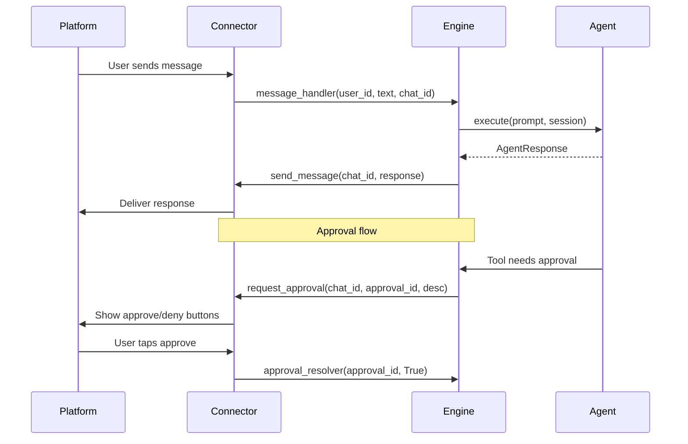

# Connector Protocol

Connectors are I/O transports that bridge leashd to external platforms. They handle message delivery, typing indicators, approval requests, file sending, and interactive UI elements. The protocol is platform-agnostic — implement `BaseConnector` to add support for any messaging platform.

## `BaseConnector` ABC

```python
class BaseConnector(ABC):
    # Required abstract methods
    async def start(self) -> None: ...
    async def stop(self) -> None: ...
    async def send_message(self, chat_id, text, buttons=None) -> None: ...
    async def send_typing_indicator(self, chat_id) -> None: ...
    async def request_approval(self, chat_id, approval_id, description, tool_name="") -> str | None: ...
    async def send_file(self, chat_id, file_path) -> None: ...

    # Optional methods (have default implementations)
    async def send_message_with_id(self, chat_id, text) -> str | None: ...
    async def edit_message(self, chat_id, message_id, text) -> None: ...
    async def delete_message(self, chat_id, message_id) -> None: ...
    async def send_question(self, chat_id, interaction_id, question_text, header, options) -> None: ...
    async def send_activity(self, chat_id, tool_name, description) -> str | None: ...
    async def clear_activity(self, chat_id) -> None: ...
    async def send_plan_messages(self, chat_id, plan_text) -> list[str]: ...
    async def delete_messages(self, chat_id, message_ids) -> None: ...
    async def send_plan_review(self, chat_id, interaction_id, description) -> None: ...
```

### Abstract Methods (Required)

| Method | Description |
|---|---|
| `start()` | Initialize the connector (connect to API, start polling) |
| `stop()` | Shut down gracefully |
| `send_message(chat_id, text, buttons)` | Send a text message, optionally with inline buttons |
| `send_typing_indicator(chat_id)` | Show a "typing..." indicator |
| `request_approval(chat_id, approval_id, description, tool_name)` | Send an approval prompt with approve/deny buttons. Returns the platform message ID (`str`) for later cleanup, or `None`. |
| `send_file(chat_id, file_path)` | Send a file to the chat |

### Optional Methods

| Method | Default | Description |
|---|---|---|
| `send_message_with_id()` | Returns `None` | Send a message and return its ID for later editing. Returning `None` disables streaming for that response. |
| `edit_message()` | No-op | Edit a previously sent message by ID |
| `delete_message()` | No-op | Delete a message by ID |
| `send_question()` | Falls back to `send_message` | Send an interactive question with option buttons |
| `send_activity()` | Returns `None` | Display tool activity status |
| `clear_activity()` | No-op | Remove the activity indicator |
| `send_plan_messages()` | Returns `[]` | Send plan content (may split across multiple messages) |
| `delete_messages()` | No-op | Delete multiple messages |
| `send_plan_review()` | Falls back to `send_message` | Send a plan review prompt with decision buttons |

## `InlineButton`

```python
class InlineButton(BaseModel):
    model_config = ConfigDict(frozen=True)

    text: str           # Display label
    callback_data: str  # Data sent back when button is pressed
```

Buttons are passed as a list of rows (`list[list[InlineButton]]`), where each inner list is one row of buttons.

## Handler Registration

The engine wires itself to the connector through five handler setters. These are called during `Engine.__init__()`:

| Method | Signature | Purpose |
|---|---|---|
| `set_message_handler()` | `(user_id, text, chat_id) -> str` | Called when a user sends a message |
| `set_approval_resolver()` | `(approval_id, approved) -> bool` | Called when a user approves or denies a tool |
| `set_interaction_resolver()` | `(interaction_id, answer) -> bool` | Called when a user answers a question |
| `set_auto_approve_handler()` | `(chat_id, tool_name) -> None` | Called when a user requests auto-approve for a tool |
| `set_command_handler()` | `(user_id, command, args, chat_id) -> str` | Called when a user issues a slash command |

## Message Flow



## Streaming Support

If a connector implements `send_message_with_id()` to return a message ID (not `None`), the engine enables streaming. During agent execution:

1. `send_message_with_id()` creates the initial message
2. `edit_message()` updates it as new text chunks arrive (throttled)
3. The engine finalizes the message when the agent completes

If `send_message_with_id()` returns `None`, streaming is disabled and the full response is sent as a single message via `send_message()`.

## Building a Connector

### Step 1: Implement the ABC

```python
from leashd.connectors.base import BaseConnector, InlineButton


class SlackConnector(BaseConnector):
    def __init__(self, bot_token: str) -> None:
        super().__init__()
        self._token = bot_token

    async def start(self) -> None:
        # Connect to Slack API, start event listener
        ...

    async def stop(self) -> None:
        # Disconnect gracefully
        ...

    async def send_message(
        self,
        chat_id: str,
        text: str,
        buttons: list[list[InlineButton]] | None = None,
    ) -> None:
        # Send message via Slack API
        ...

    async def send_typing_indicator(self, chat_id: str) -> None:
        # Show typing indicator
        ...

    async def request_approval(
        self,
        chat_id: str,
        approval_id: str,
        description: str,
        tool_name: str = "",
    ) -> str | None:
        # Send approval request with buttons, return message ID for cleanup
        # When user clicks, call self._approval_resolver(approval_id, True/False)
        ...

    async def send_file(self, chat_id: str, file_path: str) -> None:
        # Upload file to channel
        ...
```

### Step 2: Wire Callbacks

When the platform delivers user actions, call the stored handlers:

```python
# When a message arrives from the platform:
if self._message_handler:
    response = await self._message_handler(user_id, text, chat_id)

# When a user clicks approve/deny:
if self._approval_resolver:
    await self._approval_resolver(approval_id, approved=True)

# When a user answers a question:
if self._interaction_resolver:
    await self._interaction_resolver(interaction_id, answer)
```

### Step 3: Pass to `build_engine()`

```python
from leashd.app import build_engine

connector = SlackConnector(bot_token="xoxb-...")
engine = build_engine(connector=connector)
```
