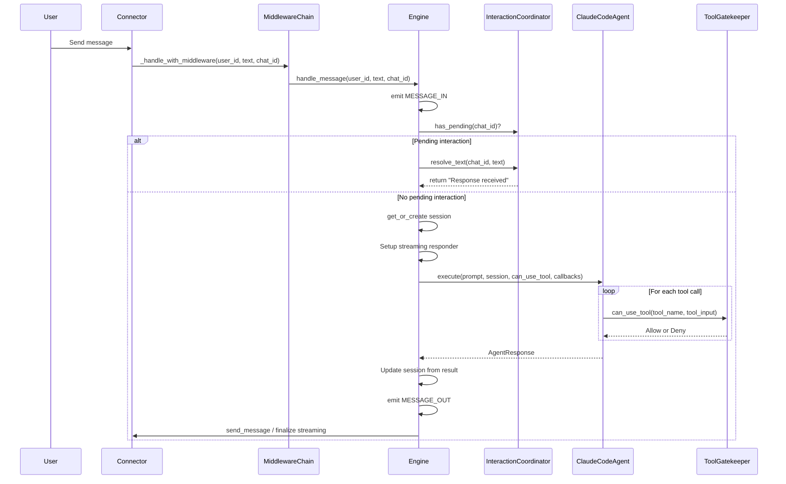
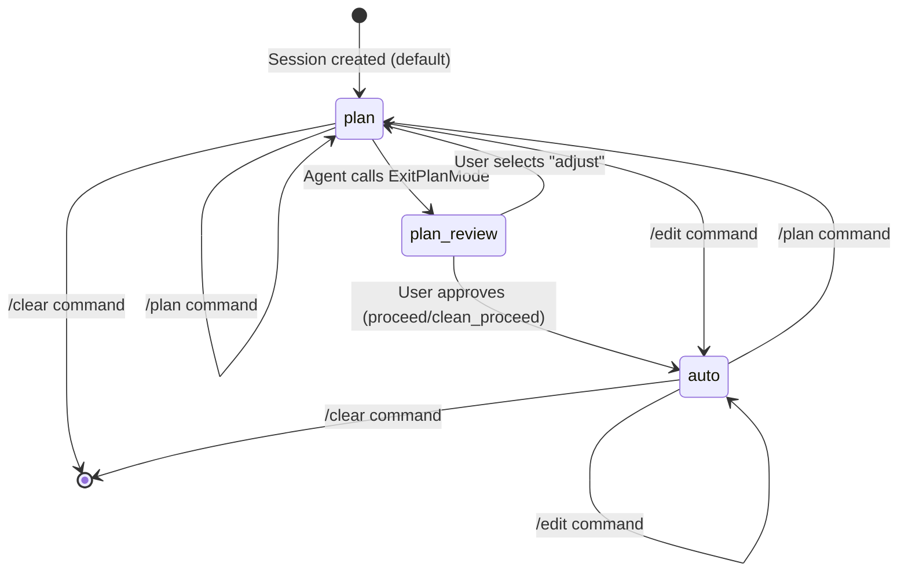
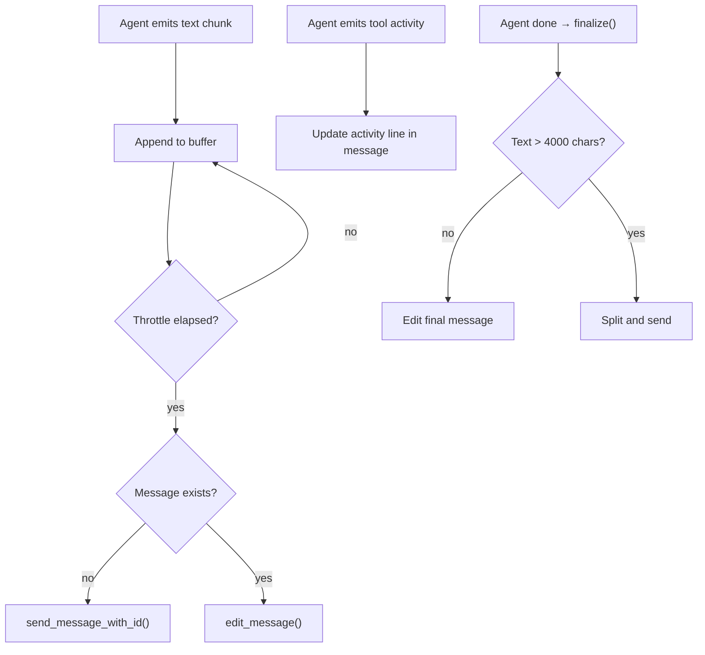

# Engine Internals

`Engine` (`core/engine.py`) is the central orchestrator. It receives user messages from connectors, passes them through middleware, routes messages to the Claude Code agent, and sends responses back. Engine handles message routing — safety is delegated entirely to `ToolGatekeeper`.

## Message Lifecycle



### Step-by-Step Trace

1. Connector receives a user message and calls `_handle_with_middleware()`
2. `MiddlewareChain` runs auth and rate limiting checks
3. `handle_message()` emits `MESSAGE_IN` event
4. If `InteractionCoordinator.has_pending(chat_id)`, the text is routed to `resolve_text()` instead of the agent
5. Otherwise, `SessionManager.get_or_create()` loads or creates a session
6. If streaming is enabled, a `_StreamingResponder` is created
7. `_build_can_use_tool()` creates the tool callback and `_ToolCallbackState`
8. `agent.execute()` runs with the prompt, session, tool callback, and streaming callbacks
9. The agent calls `can_use_tool` for each tool — this routes to the gatekeeper or interaction coordinator
10. On completion, session is updated with cost, turn count, and claude_session_id
11. `MESSAGE_OUT` is emitted and the response is sent via connector
12. Messages are logged to storage if using `SqliteSessionStore`

## Middleware Integration

`Engine` wraps `handle_message()` with middleware via `_handle_with_middleware()`. The connector calls this wrapper, not `handle_message()` directly.

`handle_message_ctx(ctx: MessageContext)` is an adapter that unpacks a `MessageContext` and delegates to `handle_message()`. This allows the middleware chain to work with its `MessageContext` model while the engine keeps its simpler signature.

## Plan Mode

Tether supports two agent modes per session: **plan** and **auto**.

In **plan** mode, the agent receives a system prompt instruction (`_PLAN_MODE_INSTRUCTION`) that tells it to explore and plan before implementing. When the agent calls `ExitPlanMode`, the user reviews the plan and decides how to proceed.



### Plan Review Flow

When `ExitPlanMode` is intercepted:

1. Engine resolves plan content from: plan file on disk, cached Write/Edit content, streaming buffer, or fallback text
2. `InteractionCoordinator.handle_plan_review()` sends the plan to the user with options
3. User chooses: **proceed** (keep context), **clean proceed** (clear context, fresh start), **adjust** (send feedback, stay in plan mode)
4. On proceed/clean_proceed, `_exit_plan_mode()` switches session to auto/edit mode and recursively calls `handle_message()` with an implementation prompt

### `_ToolCallbackState`

A per-request mutable state bag tracking plan mode state:

```python
class _ToolCallbackState:
    clean_proceed: bool       # Whether to clear context on proceed
    plan_review_shown: bool   # Whether plan review was already shown
    plan_file_content: str | None  # Cached content from Write/Edit to plan files
    plan_file_path: str | None     # Path of the plan file
    target_mode: str = "edit"      # Target mode after plan approval
```

## Slash Commands

The engine handles four commands via `handle_command()`:

| Command | Effect |
|---|---|
| `/plan` | Sets `session.mode = "plan"`, disables auto-approve |
| `/edit` | Sets `session.mode = "auto"`, enables auto-approve for Write and Edit |
| `/clear` | Deactivates session (forces new session next message), disables auto-approve |
| `/status` | Returns current mode, message count, total cost, auto-approve status |

## Streaming

`_StreamingResponder` manages real-time message updates to the connector during agent execution.



Key behaviors:
- **Throttling** — Updates are sent at most every `streaming_throttle_seconds` (default 1.5s) to avoid rate limits
- **Cursor character** — A `|` cursor is appended during streaming to indicate activity
- **4000 character limit** — Messages exceeding this limit are split
- **Tool activity** — Tool names and descriptions are shown as a status line during execution
- **Finalization** — When the agent finishes, the final message is sent with tool summary and the cursor is removed

If the connector's `send_message_with_id()` returns `None`, streaming is disabled for that response and the full text is sent at the end.

## Error Handling

When an `AgentError` occurs during execution:

1. All pending approvals for the chat are cancelled via `ApprovalCoordinator.cancel_pending()`
2. All pending interactions are cancelled via `InteractionCoordinator.cancel_pending()`
3. The error message is returned to the user
