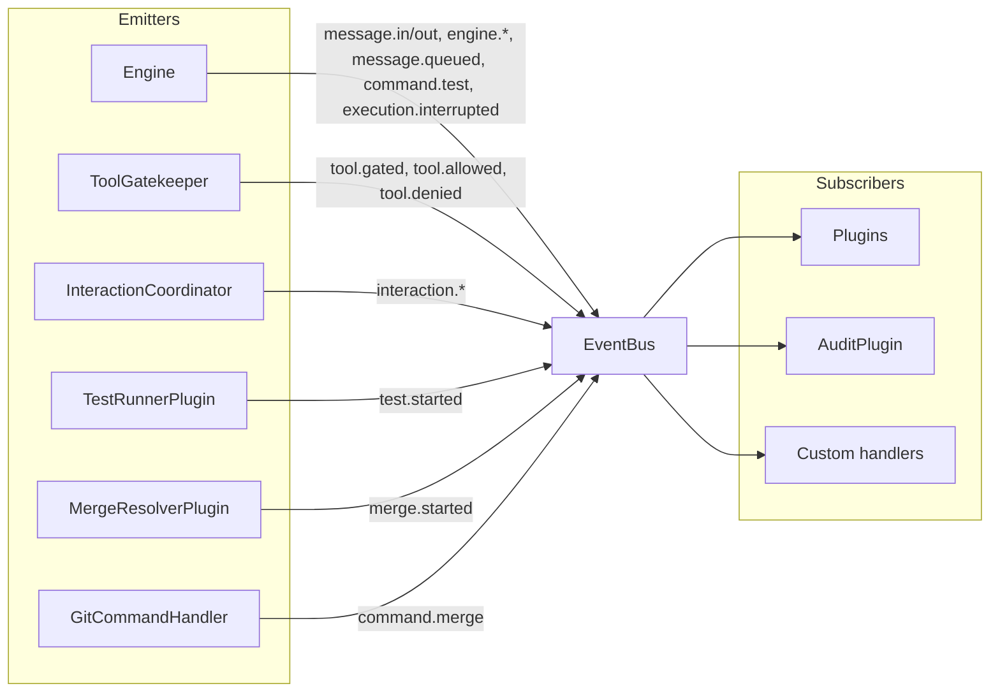

# EventBus Reference

`EventBus` (`core/events.py`) is Tether's async pub/sub system. It decouples subsystems so plugins, audit logging, and internal components can react to system events without direct dependencies.

## Core Types

### `Event`

```python
class Event(BaseModel):
    model_config = ConfigDict(frozen=True)

    name: str
    data: dict[str, Any] = Field(default_factory=dict)
    timestamp: datetime = Field(default_factory=lambda: datetime.now(UTC))
```

### `EventHandler`

```python
EventHandler = Callable[[Event], Coroutine[Any, Any, None]]
```

## API

| Method | Description |
|---|---|
| `subscribe(event_name, handler)` | Register a handler for an event type |
| `unsubscribe(event_name, handler)` | Remove a handler |
| `emit(event)` | Fire an event to all subscribed handlers |

`emit()` calls handlers sequentially in a `for` loop. If a handler raises an exception, it is logged but does not affect other handlers — error isolation is built in.

## Event Flow



## Event Reference

| Event Name | Constant | Emitter | Payload Keys | Notes |
|---|---|---|---|---|
| `tool.gated` | `TOOL_GATED` | `ToolGatekeeper` | `session_id`, `tool_name`, `tool_input` | Emitted when a tool call enters the safety pipeline |
| `tool.allowed` | `TOOL_ALLOWED` | `ToolGatekeeper` | `session_id`, `tool_name`, `tool_input` | Tool passed all checks and will execute |
| `tool.denied` | `TOOL_DENIED` | `ToolGatekeeper` | `session_id`, `tool_name`, `reason`, `violation_type` | Tool was blocked. `violation_type` is `"sandbox"` for path violations |
| `message.in` | `MESSAGE_IN` | `Engine` | `user_id`, `chat_id`, `text` | User message received |
| `message.out` | `MESSAGE_OUT` | `Engine` | `user_id`, `chat_id`, `text` | Response sent to user |
| `message.queued` | `MESSAGE_QUEUED` | `Engine` | `user_id`, `chat_id`, `text` | Message queued while agent is executing |
| `engine.started` | `ENGINE_STARTED` | `Engine` | *(empty)* | Engine startup complete |
| `engine.stopped` | `ENGINE_STOPPED` | `Engine` | *(empty)* | Engine shutdown initiated |
| `execution.interrupted` | `EXECUTION_INTERRUPTED` | `Engine` | `user_id`, `chat_id` | Agent execution interrupted by user |
| `interaction.requested` | `INTERACTION_REQUESTED` | `InteractionCoordinator` | `chat_id`, `kind`, `interaction_id` | User interaction prompt sent |
| `interaction.resolved` | `INTERACTION_RESOLVED` | `InteractionCoordinator` | `chat_id`, `kind`, `interaction_id` | User responded to interaction |
| `command.test` | `COMMAND_TEST` | `Engine` | `chat_id`, `args` | `/test` command received |
| `test.started` | `TEST_STARTED` | `TestRunnerPlugin` | `chat_id`, `config` | Test workflow started |
| `command.merge` | `COMMAND_MERGE` | `GitCommandHandler` | `chat_id`, `branch` | `/git merge` command received |
| `merge.started` | `MERGE_STARTED` | `MergeResolverPlugin` | `chat_id` | Merge conflict resolution started |

## Plugin Subscription Pattern

Plugins subscribe to events in their `initialize()` method:

```python
class MyPlugin:
    meta = PluginMeta(name="my-plugin", version="0.1.0")

    async def initialize(self, context: PluginContext) -> None:
        context.event_bus.subscribe(TOOL_DENIED, self._on_denied)
        context.event_bus.subscribe(MESSAGE_IN, self._on_message)

    async def _on_denied(self, event: Event) -> None:
        tool = event.data["tool_name"]
        reason = event.data["reason"]
        # React to denial...

    async def _on_message(self, event: Event) -> None:
        user = event.data["user_id"]
        text = event.data["text"]
        # React to message...
```

See [Plugins](plugins.md) for the full plugin protocol and lifecycle.
