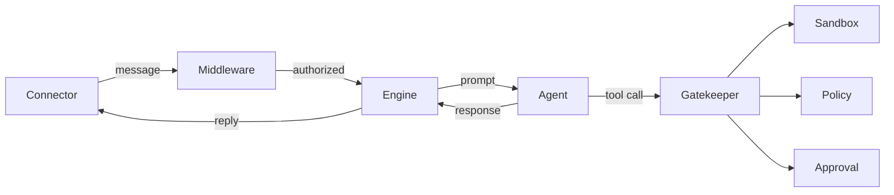

# Tether Documentation

Tether is an open-source remote AI-assisted development framework. It lets developers drive Claude Code agent sessions from any device while enforcing YAML-driven safety policies that gate dangerous AI actions behind human approval. The system is modular, lightweight, and bulletproof.

## Three Guarantees

1. **Safety-first** — Every tool call passes through a three-layer pipeline (sandbox, policy, approval) before execution. Destructive operations require explicit human consent.
2. **Pluggable** — Agents, connectors, middleware, storage backends, and plugins are all protocol-based. Swap or extend any component without touching the core.
3. **Auditable** — Every tool attempt, approval decision, and safety violation is logged to an append-only JSONL audit trail.

## System Overview



## Documentation Map

| Document | Description |
|---|---|
| [Architecture](architecture.md) | Component map, dependency injection, startup/shutdown lifecycle |
| [Safety Pipeline](safety-pipeline.md) | Gatekeeper, sandbox, policy engine, approval coordinator |
| [Engine](engine.md) | Message lifecycle, plan mode, streaming, slash commands |
| [Configuration](configuration.md) | All `TETHER_` environment variables reference |
| [Policies](policies.md) | YAML policy format, rule matching algorithm, built-in presets |
| [Events](events.md) | EventBus, all event types, payload schemas |
| [Plugins](plugins.md) | Plugin protocol, lifecycle hooks, AuditPlugin example |
| [Agents](agents.md) | BaseAgent protocol, ClaudeCodeAgent, session resume |
| [Connectors](connectors.md) | BaseConnector ABC, handler registration, building a connector |
| [Middleware](middleware.md) | MiddlewareChain, auth, rate limiting |
| [Storage](storage.md) | SessionStore protocol, memory and SQLite backends |
| [Browser Testing](browser-testing.md) | Playwright MCP setup, browser tool policies, test agents |
| [Interactions](interactions.md) | Question flow, plan review flow, asyncio bridge |
| [Testing Setup](testing-setup.md) | Three-tier setup guide for e2e testing with /test and Playwright |

## Quick Start

```bash
# Clone and install
git clone <repo-url>
cd tether
uv sync

# Minimal .env
echo 'TETHER_APPROVED_DIRECTORIES=/path/to/your/project' > .env

# Run the CLI (interactive REPL)
uv run -m tether

# Run with Telegram connector
echo 'TETHER_TELEGRAM_BOT_TOKEN=your-bot-token' >> .env
uv run -m tether
```

See [Configuration](configuration.md) for the full environment variable reference.
