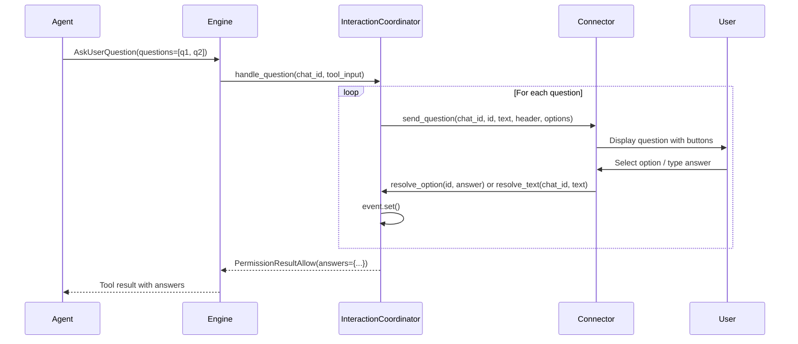
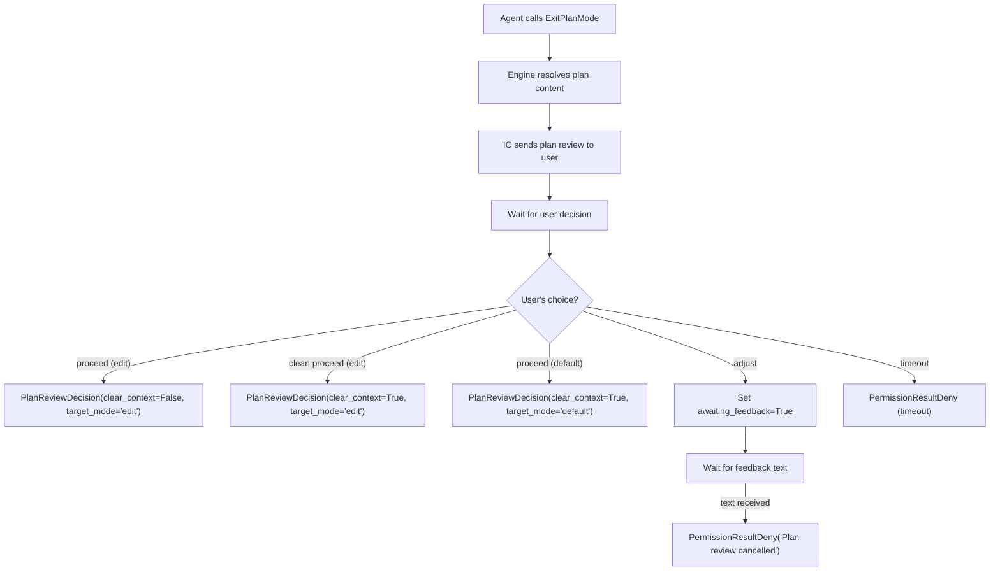

# Interactions System

The interactions system bridges SDK tool calls to async human I/O. When the agent needs user input — answering questions or reviewing a plan — `InteractionCoordinator` manages the async handoff between the agent's synchronous tool call and the user's eventual response via the connector.

## `PendingInteraction`

```python
class PendingInteraction(BaseModel):
    model_config = ConfigDict(arbitrary_types_allowed=True)

    interaction_id: str
    chat_id: str
    kind: str                  # "question" or "plan_review"
    event: asyncio.Event = Field(default_factory=asyncio.Event)
    answer: str | None = None
    decision: str | None = None  # "clean_edit" | "edit" | "default" | "adjust"
    feedback: str | None = None
    awaiting_feedback: bool = False
```

Each pending interaction has an `asyncio.Event` that blocks the agent's tool call until the user responds. The coordinator maintains a dual index — by `interaction_id` (for button callbacks) and by `chat_id` (for text routing).

## `InteractionCoordinator`

`InteractionCoordinator` (`core/interactions.py`) manages two flows: questions and plan reviews.

### Key Methods

| Method | Description |
|---|---|
| `handle_question(chat_id, tool_input)` | Send questions to user, collect answers |
| `handle_plan_review(chat_id, tool_input, plan_content)` | Send plan for review, collect decision |
| `resolve_option(interaction_id, answer)` | Called by connector when user clicks a button |
| `resolve_text(chat_id, text)` | Called by connector when user sends text during a pending interaction |
| `has_pending(chat_id)` | Check if a chat has any pending interactions |
| `cancel_pending(chat_id)` | Cancel all pending interactions for a chat |

## Question Flow

When the agent calls `AskUserQuestion`, the engine intercepts the tool call and delegates to `InteractionCoordinator.handle_question()`.



Key behaviors:

- Questions are sent **sequentially**, one at a time. The next question is sent only after the previous one is answered.
- Users can respond via button click (`resolve_option`) or free text (`resolve_text`).
- On timeout, returns `PermissionResultDeny`.
- Emits `INTERACTION_REQUESTED` when the first question is sent and `INTERACTION_RESOLVED` when all answers are collected.

## Plan Review Flow

When the agent calls `ExitPlanMode`, the engine resolves the plan content and delegates to `InteractionCoordinator.handle_plan_review()`.



### `PlanReviewDecision`

```python
class PlanReviewDecision(BaseModel):
    model_config = ConfigDict(frozen=True, arbitrary_types_allowed=True)

    permission: PermissionResultAllow
    clear_context: bool
    target_mode: str  # "edit" or "default"
```

Returned when the user approves the plan. The engine uses `clear_context` to decide whether to clear the claude_session_id (fresh start) or keep it (resume context). `target_mode` determines whether Write/Edit auto-approve is enabled.

### Two-Step Adjust

When the user selects "adjust":

1. `awaiting_feedback` is set to `True` on the `PendingInteraction`
2. The connector prompts the user for feedback text
3. When text arrives via `resolve_text()`, it is stored as `feedback` and the event is signaled
4. The coordinator returns `PermissionResultDeny` with the feedback, which causes the agent to stay in plan mode and incorporate the feedback

## Text Routing

In `Engine.handle_message()`, the first check is:

```python
if self._interaction_coordinator.has_pending(chat_id):
    await self._interaction_coordinator.resolve_text(chat_id, text)
    return "Response received."
```

This intercepts user messages during an active interaction and routes them to the coordinator instead of the agent. Without this, user responses to questions or feedback prompts would be treated as new agent prompts.

## Timeout Behavior

All interactions use `asyncio.wait_for()` with the configured timeout (`LEASHD_APPROVAL_TIMEOUT_SECONDS`, default 300s). On timeout:

- The pending interaction is cleaned up
- `PermissionResultDeny` is returned
- The agent receives a denial and can decide how to proceed

## Cancellation

`cancel_pending(chat_id)` cancels all pending interactions for a chat. This is called during error handling (when `AgentError` occurs) and on `/clear`. It sets the event without an answer, causing the waiting coroutine to return a denial.
