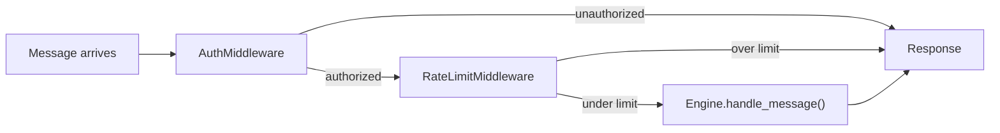
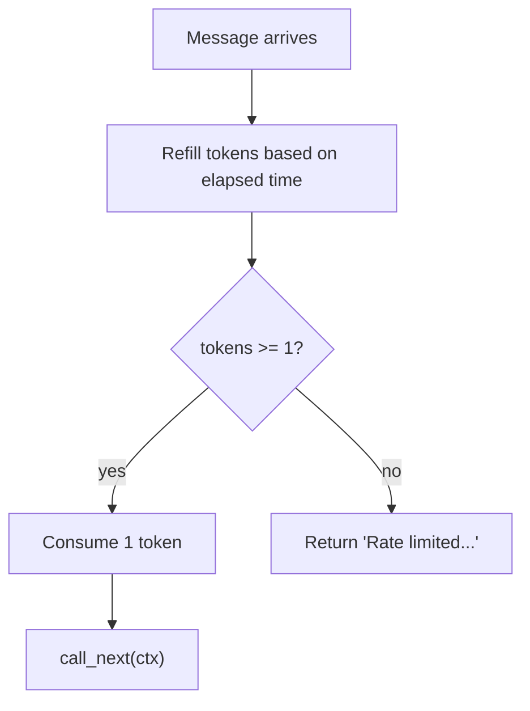

# Middleware

Middleware processes messages before they reach the engine. It handles cross-cutting concerns like authentication and rate limiting without modifying engine logic.

## Core Types

### `MessageContext`

```python
class MessageContext(BaseModel):
    model_config = ConfigDict(frozen=True)

    user_id: str
    chat_id: str
    text: str
    metadata: dict[str, Any] = Field(default_factory=dict)
```

An immutable message envelope that flows through the middleware chain.

### `Middleware` ABC

```python
class Middleware(ABC):
    async def process(self, ctx: MessageContext, call_next: NextHandler) -> str: ...
```

Each middleware receives the context and a `call_next` function. It can:
- **Pass through** — call `call_next(ctx)` to continue the chain
- **Short-circuit** — return a string directly without calling `call_next`
- **Modify** — create a new `MessageContext` and pass it to `call_next`

### `NextHandler`

```python
NextHandler = Callable[[MessageContext], Awaitable[str]]
```

## `MiddlewareChain`

`MiddlewareChain` (`middleware/base.py`) composes middleware into a single callable using closure-based chaining. Registration order is execution order.

```python
chain = MiddlewareChain()
chain.add(AuthMiddleware(allowed_user_ids={"123"}))
chain.add(RateLimitMiddleware(requests_per_minute=30))
```

| Method | Description |
|---|---|
| `add(middleware)` | Append middleware to the chain |
| `has_middleware()` | Returns `True` if any middleware is registered |
| `run(ctx, handler)` | Execute the chain, falling through to `handler` |

### Chain Execution



Internally, `run()` wraps the handler and each middleware in reverse order to build a nested call chain. The first middleware added is the first to execute.

## Built-In Middleware

### `AuthMiddleware`

`AuthMiddleware` (`middleware/auth.py`) checks if the user is in the allowed set.

```python
AuthMiddleware(allowed_user_ids: set[str], *, allow_all: bool = False)
```

| Parameter | Description |
|---|---|
| `allowed_user_ids` | Set of user IDs permitted to interact |
| `allow_all` | If `True`, skip the check entirely |

If the set is empty during `build_engine()`, `allow_all` is set to `True` automatically. Unauthorized users receive `"Unauthorized: ..."`.

### `RateLimitMiddleware`

`RateLimitMiddleware` (`middleware/rate_limit.py`) enforces per-user rate limits using a token bucket algorithm.

```python
RateLimitMiddleware(requests_per_minute: int, burst: int = 5)
```

| Parameter | Description |
|---|---|
| `requests_per_minute` | Sustained rate limit. `0` disables rate limiting. |
| `burst` | Maximum burst size (tokens available at start) |

#### Token Bucket Algorithm



Each user gets their own `TokenBucket`. Tokens refill at `requests_per_minute / 60` tokens per second, up to the burst limit. If no tokens are available, the message is rejected without reaching the engine.

## Writing Custom Middleware

```python
from leashd.middleware.base import MessageContext, Middleware, NextHandler


class LoggingMiddleware(Middleware):
    async def process(self, ctx: MessageContext, call_next: NextHandler) -> str:
        print(f"[{ctx.user_id}] {ctx.text}")
        response = await call_next(ctx)
        print(f"[response] {response[:100]}")
        return response
```

Register during engine construction. `build_engine()` adds auth and rate limit middleware automatically when configured. To add custom middleware, modify the chain before passing it to the engine:

```python
from leashd.middleware.base import MiddlewareChain

chain = MiddlewareChain()
chain.add(AuthMiddleware(allowed_user_ids={"123"}))
chain.add(LoggingMiddleware())
chain.add(RateLimitMiddleware(requests_per_minute=30))
```
