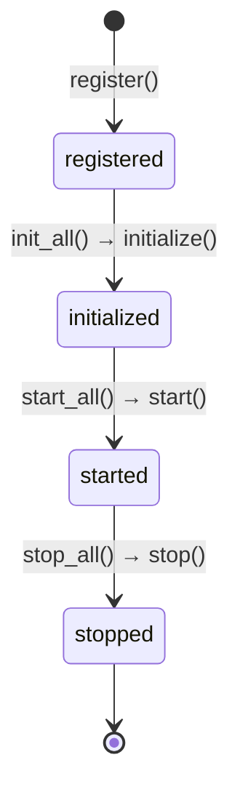
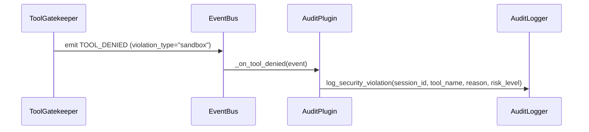
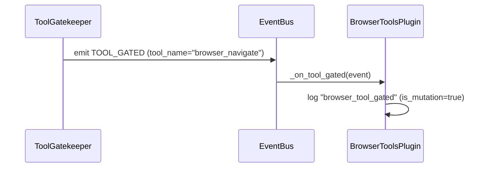

# Plugin System

Plugins extend Tether with observability, custom logic, and integration hooks. They subscribe to `EventBus` events and react without modifying core components.

## Plugin Protocol

```python
class TetherPlugin(Protocol):
    meta: PluginMeta

    async def initialize(self, context: PluginContext) -> None: ...
    async def start(self) -> None: ...
    async def stop(self) -> None: ...
```

### `PluginMeta`

```python
class PluginMeta(BaseModel):
    model_config = ConfigDict(frozen=True)

    name: str
    version: str
    description: str = ""
```

### `PluginContext`

```python
class PluginContext(BaseModel):
    model_config = ConfigDict(frozen=True, arbitrary_types_allowed=True)

    event_bus: EventBus
    config: TetherConfig
```

Plugins receive a `PluginContext` during initialization. This gives them access to the event bus for subscribing to events and the configuration for reading settings.

## Lifecycle



| Phase | Method | When | Purpose |
|---|---|---|---|
| Register | — | `build_engine()` | Plugin added to `PluginRegistry` |
| Initialize | `initialize(context)` | `Engine.startup()` → `PluginRegistry.init_all()` | Subscribe to events, set up resources |
| Start | `start()` | After all plugins are initialized | Begin background tasks |
| Stop | `stop()` | `Engine.shutdown()` → `PluginRegistry.stop_all()` | Clean up resources |

Plugins are stopped in **LIFO order** (last registered, first stopped) to respect dependency ordering.

## Plugin Registry

`PluginRegistry` (`plugins/registry.py`) manages the plugin collection:

| Method | Description |
|---|---|
| `register(plugin)` | Add a plugin. Raises `PluginError` if name already registered. |
| `get(name)` | Retrieve a plugin by name. Returns `None` if not found. |
| `plugins` | Property returning the list of all registered plugins. |
| `init_all(context)` | Call `initialize()` on each plugin in registration order. |
| `start_all()` | Call `start()` on each plugin. |
| `stop_all()` | Call `stop()` on each plugin in reverse order. |

## Built-In: `AuditPlugin`

`AuditPlugin` (`plugins/builtin/audit_plugin.py`) logs sandbox violations from `TOOL_DENIED` events to the audit trail.



### Implementation

```python
class AuditPlugin:
    meta = PluginMeta(
        name="audit",
        version="0.1.0",
        description="Logs sandbox violations from TOOL_DENIED events",
    )

    def __init__(self, audit_logger: AuditLogger) -> None:
        self._audit = audit_logger

    async def initialize(self, context: PluginContext) -> None:
        context.event_bus.subscribe(TOOL_DENIED, self._on_tool_denied)

    async def start(self) -> None:
        pass  # No background tasks

    async def stop(self) -> None:
        pass  # No cleanup needed

    async def _on_tool_denied(self, event: Event) -> None:
        if event.data.get("violation_type") == "sandbox":
            self._audit.log_security_violation(
                session_id=event.data["session_id"],
                tool_name=event.data["tool_name"],
                reason=event.data["reason"],
                risk_level="high",
            )
```

The plugin only reacts to sandbox violations (not policy denials) to avoid duplicating audit entries that the gatekeeper already logs directly.

## Built-In: `BrowserToolsPlugin`

`BrowserToolsPlugin` (`plugins/builtin/browser_tools.py`) provides observability for the 25 Playwright MCP browser tools. It logs when browser tools enter the safety pipeline, are allowed, or are denied.



### Events

| Event | Handler | Logged when |
|---|---|---|
| `TOOL_GATED` | `_on_tool_gated` | A browser tool call enters the safety pipeline |
| `TOOL_ALLOWED` | `_on_tool_allowed` | A browser tool call is approved |
| `TOOL_DENIED` | `_on_tool_denied` | A browser tool call is denied (logged at warning level) |

Each log entry includes the `tool_name`, `session_id`, and (for gated events) an `is_mutation` flag indicating whether the tool modifies the browser state.

### Exported Constants

The module exports constants for classifying browser tools in other components:

| Export | Type | Description |
|---|---|---|
| `BROWSER_READONLY_TOOLS` | `frozenset[str]` | 7 tools that observe without changing the page |
| `BROWSER_MUTATION_TOOLS` | `frozenset[str]` | 18 tools that interact with or modify the page |
| `ALL_BROWSER_TOOLS` | `frozenset[str]` | Union of readonly and mutation sets (25 total) |
| `is_browser_tool(name)` | `function` | Returns `True` if the tool name is a Playwright browser tool |

See [Browser Testing](browser-testing.md) for the full browser testing guide.

## Writing a Custom Plugin

### Step 1: Define the Plugin

```python
from tether.plugins.base import PluginContext, PluginMeta, TetherPlugin
from tether.core.events import MESSAGE_IN, Event


class MetricsPlugin:
    meta = PluginMeta(
        name="metrics",
        version="0.1.0",
        description="Tracks message counts per user",
    )

    def __init__(self) -> None:
        self._counts: dict[str, int] = {}

    async def initialize(self, context: PluginContext) -> None:
        context.event_bus.subscribe(MESSAGE_IN, self._on_message)

    async def start(self) -> None:
        pass

    async def stop(self) -> None:
        # Flush metrics, close connections, etc.
        pass

    async def _on_message(self, event: Event) -> None:
        user_id = event.data["user_id"]
        self._counts[user_id] = self._counts.get(user_id, 0) + 1
```

### Step 2: Register via `build_engine()`

```python
from tether.app import build_engine

engine = build_engine(plugins=[MetricsPlugin()])
```

The `AuditPlugin` is always registered automatically. User-provided plugins are registered after it.
