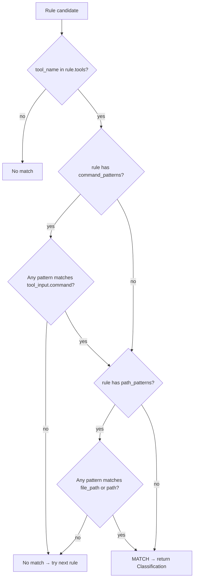
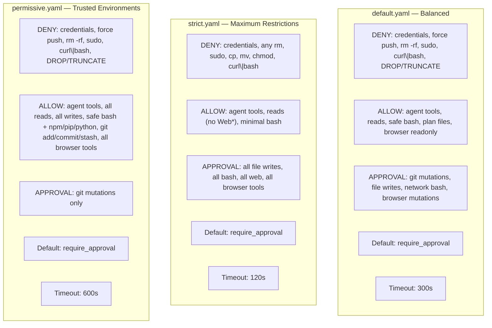

# Policy System

Policies define which tool calls the agent can execute, which are blocked, and which require human approval. They are written in YAML — readable, version-controlled, and swappable at startup via `TETHER_POLICY_FILES`.

## YAML File Structure

```yaml
version: "1"
name: "policy-name"

settings:
  default_action: require_approval  # Fallback when no rule matches
  approval_timeout_seconds: 300

rules:
  - name: "rule-name"
    tools: ["Bash"]
    command_patterns: ["^rm -rf"]
    path_patterns: ["\\.env$"]
    action: deny
    reason: "Destructive operation"
    risk_level: high
```

### Top-Level Fields

| Field | Required | Description |
|---|---|---|
| `version` | Yes | Policy format version (currently `"1"`) |
| `name` | Yes | Human-readable policy name |
| `settings` | No | Global settings (default_action, approval_timeout_seconds) |
| `rules` | Yes | Ordered list of rules |

### Rule Anatomy

| Field | Required | Type | Description |
|---|---|---|---|
| `name` | Yes | `str` | Unique rule identifier |
| `tools` | Yes | `list[str]` | Tool names this rule applies to. A rule with no tools never matches. |
| `command_patterns` | No | `list[str]` | Regex patterns matched against `tool_input["command"]`. Only relevant for Bash. |
| `path_patterns` | No | `list[str]` | Regex patterns matched against `tool_input["file_path"]` or `tool_input["path"]`. |
| `action` | Yes | `str` | One of: `allow`, `deny`, `require_approval` |
| `reason` | No | `str` | Human-readable explanation shown when rule triggers |
| `description` | No | `str` | Extended description of the rule's purpose |
| `risk_level` | No | `str` | `low`, `medium` (default), `high`, or `critical` |

## Rule Matching Algorithm

`PolicyEngine.classify()` iterates rules in order and returns the first match. The matching logic in `_rule_matches()`:



Key behaviors:
- **First-match wins** — Rules are evaluated top-to-bottom. The first matching rule determines the action.
- **AND logic** — If a rule has both `command_patterns` and `path_patterns`, both must match.
- **Tool check is mandatory** — A rule must have `tools` defined and the tool name must be in the list.
- **Regex matching** — Patterns are compiled as Python `re` regexes. They use `search()`, not `match()`, so patterns match anywhere in the string.
- **Command patterns** — Only checked for `Bash` tool calls. The pattern is matched against `tool_input["command"]`.
- **Path patterns** — Checked against `tool_input["file_path"]` (primary) or `tool_input["path"]` (fallback).

If no rule matches, `evaluate()` returns the `default_action` from settings (typically `require_approval`).

## Three Actions

| Action | Effect |
|---|---|
| `allow` | Tool executes immediately. No user interaction needed. |
| `deny` | Tool is blocked. The deny reason is returned to the agent. |
| `require_approval` | Tool is held pending. User sees an approve/deny prompt via the connector. Timeout defaults to deny. |

## Built-In Presets

Tether ships with three policy files in `policies/`:



### Comparison Table

| Aspect | Default | Strict | Permissive |
|---|---|---|---|
| File writes | Approval | Approval | Allow |
| Read tools | Allow | Allow | Allow |
| Web tools | Allow | Approval | Allow |
| Safe bash (ls, git status) | Allow | Allow (minimal) | Allow (extended) |
| Git mutations | Approval | Approval | Approval |
| Browser tools (readonly) | Allow | Approval | Allow |
| Browser tools (mutation) | Approval | Approval | Allow |
| rm -rf / sudo | Deny | Deny | Deny |
| Credential files | Deny | Deny | Deny |
| Approval timeout | 300s | 120s | 600s |
| Default action | require_approval | require_approval | require_approval |

## Writing Custom Policies

1. Create a YAML file following the format above
2. Place deny rules first (block dangerous operations)
3. Then allow rules (permit safe operations)
4. Then require_approval rules (gate everything else)
5. Set the policy file path:

```env
TETHER_POLICY_FILES=policies/default.yaml,path/to/custom.yaml
```

Multiple policy files are loaded in order. Later files can add rules and override settings. Rules from all files are combined into a single ordered list.

### Example: Custom Project Policy

```yaml
version: "1"
name: "my-project"

settings:
  default_action: require_approval
  approval_timeout_seconds: 180

rules:
  - name: deny-migrations
    tools: ["Bash"]
    command_patterns: ["migrate", "db:push"]
    action: deny
    reason: "Database migrations must be run manually"
    risk_level: critical

  - name: allow-tests
    tools: ["Bash"]
    command_patterns: ["^(uv run )?pytest", "^(uv run )?ruff"]
    action: allow
    risk_level: low

  - name: allow-project-writes
    tools: ["Write", "Edit"]
    path_patterns: ["^src/"]
    action: allow
    risk_level: low
```
