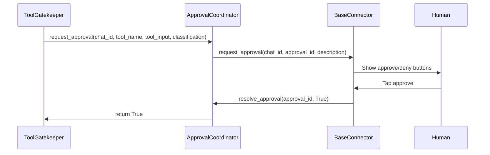
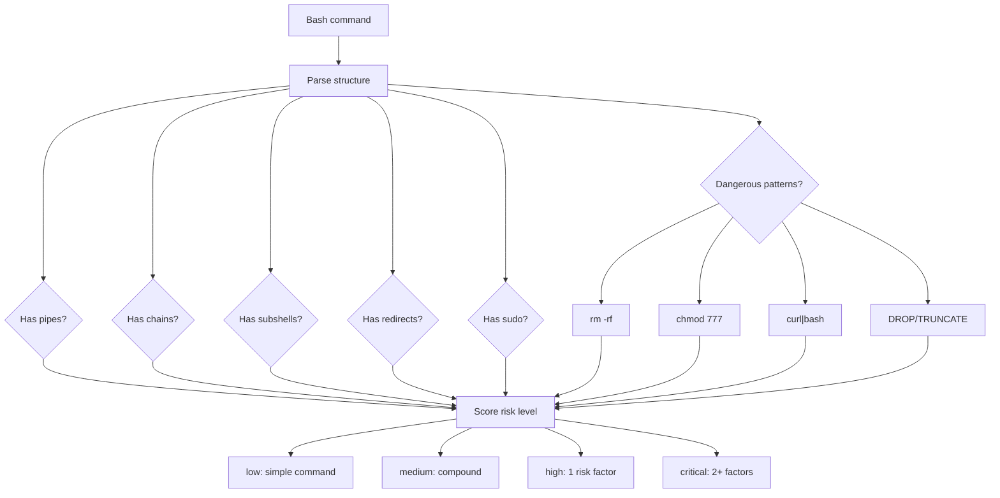

# Safety Pipeline

The safety pipeline runs per tool call, not per message. Every tool the agent attempts must pass through three layers before execution: sandbox enforcement, policy evaluation, and (when required) human approval.

## Orchestrator: `ToolGatekeeper`

`ToolGatekeeper` (`core/safety/gatekeeper.py`) orchestrates the full pipeline. It receives a tool name and input, runs each layer in sequence, emits events at each stage, and returns either `PermissionResultAllow` or `PermissionResultDeny`.

```python
async check(
    self,
    tool_name: str,
    tool_input: dict[str, Any],
    session_id: str,
    chat_id: str,
) -> PermissionResultAllow | PermissionResultDeny
```

### Auto-Approve

The gatekeeper supports two levels of auto-approve to skip the approval step:

- **Blanket** — `enable_auto_approve(chat_id)` auto-approves all tools for a chat. Used when switching to "auto" mode.
- **Per-tool** — `enable_tool_auto_approve(chat_id, tool_name)` auto-approves a specific tool. Used when entering "edit" mode to auto-approve `Write` and `Edit`.

`disable_auto_approve(chat_id)` clears both levels. `get_auto_approve_status(chat_id)` returns the current state as `(blanket_enabled, set_of_tool_names)`.

## Full Pipeline Flow

```mermaid
flowchart TD
    call["Tool call arrives"]
    gated["emit TOOL_GATED"]
    sandbox{"Sandbox check"}
    deny_sandbox["emit TOOL_DENIED + audit log"]
    policy{"Policy evaluate"}
    allow_policy["ALLOW"]
    deny_policy["DENY"]
    approval_req["REQUIRE_APPROVAL"]
    auto{"Auto-approved?"}
    request["Request human approval"]
    approved{"User approves?"}
    timeout["Timeout → deny"]
    allow_final["emit TOOL_ALLOWED"]
    deny_final["emit TOOL_DENIED"]

    call --> gated --> sandbox
    sandbox -->|fail| deny_sandbox --> deny_final
    sandbox -->|pass| policy
    policy --> allow_policy --> allow_final
    policy --> deny_policy --> deny_final
    policy --> approval_req --> auto
    auto -->|yes| allow_final
    auto -->|no| request --> approved
    approved -->|yes| allow_final
    approved -->|no| deny_final
    approved -->|timeout| timeout --> deny_final
```

## Layer 1: Sandbox — `SandboxEnforcer`

`SandboxEnforcer` (`core/safety/sandbox.py`) enforces directory boundaries. It prevents the agent from reading or writing files outside approved directories.

### How It Works

The sandbox maintains a list of allowed directories. By default, `build_engine()` adds:

1. All entries from `config.approved_directories` — the project directories
2. `~/.claude/plans` — Claude Code's plan file storage

`validate_path(path)` resolves the path (expanding `~`, resolving symlinks) and checks if it falls within any allowed directory. Returns `(ok, reason)`.

The gatekeeper only runs sandbox checks on **path tools**, defined by the `DEFAULT_PATH_TOOLS` frozenset:

```python
DEFAULT_PATH_TOOLS = frozenset({
    "Read", "Write", "Edit", "Glob", "Grep", "NotebookEdit"
})
```

Non-path tools (like `Bash`, `WebSearch`) skip the sandbox check entirely — their safety is handled by the policy layer.

## Layer 2: Policy — `PolicyEngine`

`PolicyEngine` (`core/safety/policy.py`) loads YAML policy files and classifies tool calls against their rules. It is stateless — the same input always produces the same output.

### Classification

`classify(tool_name, tool_input)` finds the first matching rule and returns a `Classification`:

```python
class Classification(BaseModel):
    model_config = ConfigDict(frozen=True)

    category: str
    tool_name: str
    tool_input: dict[str, Any]
    risk_level: str = "medium"
    description: str = ""
    deny_reason: str | None = None
    matched_rule: PolicyRule | None = None
```

### Evaluation

`evaluate(classification)` returns one of three `PolicyDecision` values:

- `ALLOW` — tool executes immediately
- `DENY` — tool is blocked, reason returned to agent
- `REQUIRE_APPROVAL` — tool needs human approval before execution

If no rule matches, the default action from policy settings applies (typically `require_approval`).

See [Policies](policies.md) for the full YAML format and rule matching algorithm.

## Layer 3: Approval — `ApprovalCoordinator`

`ApprovalCoordinator` (`core/safety/approvals.py`) bridges tool calls that need human consent to the connector's UI.



### Timeout Behavior

If the user does not respond within the timeout period (configurable via `LEASHD_APPROVAL_TIMEOUT_SECONDS`, default 300s), the approval defaults to **deny**. This is the safe default — silence means no.

### `PendingApproval` Tracking

Each approval request creates a `PendingApproval` with an `asyncio.Event`. The coordinator waits on this event with the configured timeout. When the connector calls `resolve_approval()`, it sets the decision and signals the event.

```python
class PendingApproval(BaseModel):
    model_config = ConfigDict(arbitrary_types_allowed=True)

    approval_id: str
    chat_id: str
    tool_name: str
    tool_input: dict[str, Any]
    event: asyncio.Event = Field(default_factory=asyncio.Event)
    decision: bool | None = None
```

## Risk Analysis

Two analyzers in `core/safety/analyzer.py` provide risk scoring used by the policy engine.

### `CommandAnalyzer`

`CommandAnalyzer.analyze_bash(command)` inspects bash commands and returns a `CommandAnalysis`:



### `PathAnalyzer`

`PathAnalyzer.analyze(path, operation)` detects credential file access and path traversal. It matches against patterns like `.env`, `.ssh/`, `.aws/`, `*.pem`, `id_rsa`, `credentials`, `secrets`, and more. Write operations to normal files get elevated sensitivity.

## Audit Logger

`AuditLogger` (`core/safety/audit.py`) writes an append-only JSONL file. Three log methods:

| Method | Event Type | Key Fields |
|---|---|---|
| `log_tool_attempt()` | `tool_attempt` | session_id, tool_name, tool_input, classification, decision |
| `log_approval()` | `approval` | session_id, tool_name, approved, user_id |
| `log_security_violation()` | `security_violation` | session_id, tool_name, reason, risk_level |

Tool input strings longer than 500 characters are truncated with `...[truncated]`. All entries include an ISO 8601 UTC timestamp.
