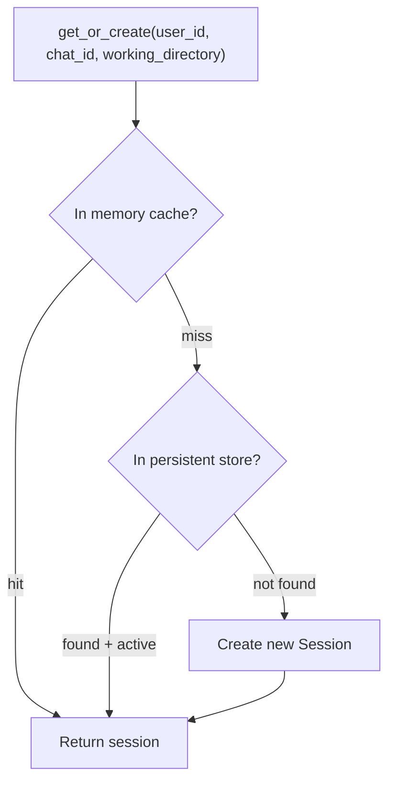
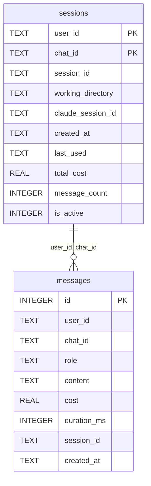

# Storage

Tether's storage layer manages session persistence and message history. It uses a protocol-based design with two built-in backends.

## `SessionStore` Protocol

```python
class SessionStore(Protocol):
    async def save(self, session: Session) -> None: ...
    async def load(self, user_id: str, chat_id: str) -> Session | None: ...
    async def delete(self, user_id: str, chat_id: str) -> None: ...
    async def setup(self) -> None: ...
    async def teardown(self) -> None: ...
```

| Method | Description |
|---|---|
| `save(session)` | Persist a session |
| `load(user_id, chat_id)` | Load an active session. Returns `None` if not found or inactive. |
| `delete(user_id, chat_id)` | Remove or deactivate a session |
| `setup()` | Initialize the backend (create tables, open connections) |
| `teardown()` | Close resources |

## `SessionManager`

`SessionManager` (`core/session.py`) wraps a `SessionStore` with an in-memory cache for fast lookups.

### Session Lookup



The lookup follows a three-tier strategy:

1. **Memory cache** — `dict` keyed by `(user_id, chat_id)`. Fastest path.
2. **Persistent store** — Calls `store.load()`. Only returns active sessions.
3. **Create new** — Generates a new `Session` with a UUID, saves to store, caches in memory.

### Key Methods

| Method | Description |
|---|---|
| `get_or_create(user_id, chat_id, working_directory)` | Three-tier lookup. Creates if not found. |
| `get(user_id, chat_id)` | Memory-only lookup. Returns `None` if not cached. |
| `update_from_result(session, claude_session_id, cost)` | Increments `message_count`, `total_cost`, updates `last_used`, and persists. |
| `deactivate(user_id, chat_id)` | Marks session inactive in memory and store. |
| `cleanup_expired(max_age_hours)` | Removes expired sessions from memory cache. Returns count removed. |

## `Session` Model

```python
class Session(BaseModel):
    session_id: str
    user_id: str
    chat_id: str
    working_directory: str
    claude_session_id: str | None = None
    created_at: datetime = Field(default_factory=lambda: datetime.now(UTC))
    last_used: datetime = Field(default_factory=lambda: datetime.now(UTC))
    total_cost: float = 0.0
    message_count: int = 0
    mode: str = "plan"          # "plan" or "auto"
    is_active: bool = True
```

`claude_session_id` stores the SDK session ID for multi-turn continuity. When cleared (via `/clear` or clean proceed), the next agent execution starts a fresh conversation.

## `MemorySessionStore`

In-process `dict` storage. Sessions are keyed by `"{user_id}:{chat_id}"`.

- **Best for:** Development, testing, single-process deployments
- **Delete behavior:** Hard delete — session is removed from the dict
- **Persistence:** None — data is lost on restart
- `setup()` and `teardown()` are no-ops

## `SqliteSessionStore`

Persistent storage via `aiosqlite`. Supports session persistence across restarts and message history logging.

- **Best for:** Production deployments where session continuity matters
- **Delete behavior:** Soft delete — sets `is_active = 0`
- **Persistence:** Full — survives restarts

### Schema



### SQL Tables

**sessions** — Primary key is `(user_id, chat_id)`. Uses `INSERT OR REPLACE` for upserts.

**messages** — Append-only log. `role` is constrained to `'user'` or `'assistant'`. Indexed on `(user_id, chat_id, created_at)`.

### Additional Methods

`SqliteSessionStore` extends the protocol with:

| Method | Description |
|---|---|
| `save_message(user_id, chat_id, role, content, cost, duration_ms, session_id)` | Log a message to the messages table |
| `get_messages(user_id, chat_id, limit, offset)` | Retrieve message history ordered by `created_at`, `id` |

The engine calls `save_message()` via `_log_message()` after each user message and agent response when using the SQLite backend.

## Writing a Custom Backend

Implement the `SessionStore` protocol:

```python
from tether.storage.base import SessionStore
from tether.core.session import Session


class RedisSessionStore:
    def __init__(self, redis_url: str) -> None:
        self._url = redis_url

    async def setup(self) -> None:
        # Connect to Redis
        ...

    async def teardown(self) -> None:
        # Close connection
        ...

    async def save(self, session: Session) -> None:
        # Serialize and store
        ...

    async def load(self, user_id: str, chat_id: str) -> Session | None:
        # Fetch and deserialize
        ...

    async def delete(self, user_id: str, chat_id: str) -> None:
        # Remove or mark inactive
        ...
```

Set `TETHER_STORAGE_BACKEND` to your backend name and update `build_engine()` to instantiate it. The `SessionManager` works with any `SessionStore` implementation.
